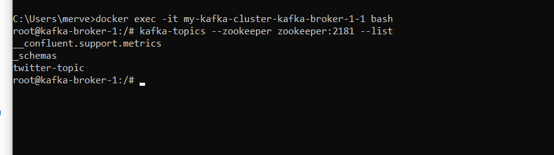
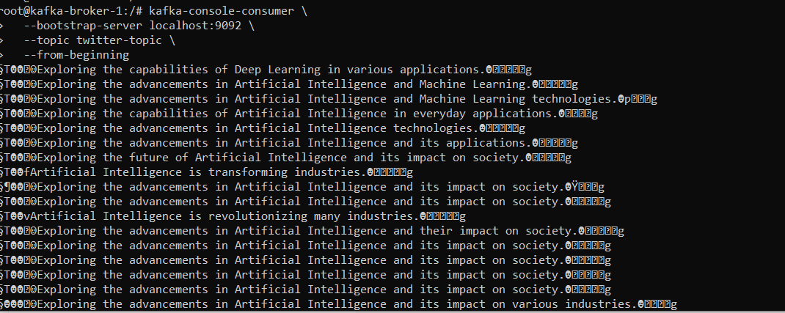

# AI Generated Tweet Kafka Service

## 🇹🇷 Genel Bakış

AI Generated Tweet Kafka Service, sistemdeki event üretici (producer) mikroservisidir.

Bu servisin temel görevi, yapay zeka kullanarak tweet içerikleri üretmek, üretilen tweetleri Avro modeline dönüştürmek ve Apache Kafka topic'lerine yayınlamaktır.

Sistemdeki diğer mikroservisler (Kafka To Elastic Service, Kafka Streams Service vb.) bu event'leri Kafka üzerinden tüketerek kendi işlemlerini gerçekleştirir.

---

## 🇬🇧 Overview

AI Generated Tweet Kafka Service is the event producer of the system.

Its responsibility is to generate tweet content using AI, convert the generated content into an Avro model and publish it to Apache Kafka topics.

Other microservices consume these events independently through Kafka.

---
# Workflow

```text
+--------------------------------------------------------------------------+
| Spring Boot Application                                                  |
|--------------------------------------------------------------------------|
| • Entry point of the microservice.                                       |
| • Creates the Spring Application Context.                                |
| • Initializes all Spring Beans.                                          |
+--------------------------------------------------------------------------+
                                   │
                                   ▼
+--------------------------------------------------------------------------+
| CommandLineRunner                                                        |
|--------------------------------------------------------------------------|
| • Executes automatically after the application starts.                   |
| • Starts the initialization workflow.                                    |
+--------------------------------------------------------------------------+
                                   │
                                   ▼
+--------------------------------------------------------------------------+
| KafkaStreamInitializer                                                   |
|--------------------------------------------------------------------------|
| • Creates Kafka topics if they do not already exist.                     |
| • Verifies Schema Registry availability.                                 |
| • Ensures Kafka infrastructure is ready before publishing messages.       |
+--------------------------------------------------------------------------+
                                   │
                                   ▼
+--------------------------------------------------------------------------+
| TaskScheduler                                                            |
|--------------------------------------------------------------------------|
| • Schedules tweet generation.                                            |
| • Executes AIStreamRunner periodically.                                  |
+--------------------------------------------------------------------------+
                                   │
                                   ▼
+--------------------------------------------------------------------------+
| AIStreamRunner                                                           |
|--------------------------------------------------------------------------|
| Coordinates the complete workflow.                                       |
|                                                                          |
| 1. Generate tweet using AI.                                              |
| 2. Convert tweet to Avro model.                                          |
| 3. Publish event to Kafka.                                               |
+--------------------------------------------------------------------------+
                                   │
                                   ▼
+--------------------------------------------------------------------------+
| AIService                                                                |
|--------------------------------------------------------------------------|
| • Common abstraction for AI providers.                                   |
| • Allows different AI implementations to be plugged in easily.           |
+--------------------------------------------------------------------------+
                                   │
                                   ▼
+--------------------------------------------------------------------------+
| SpringAIOpenAIService                                                    |
|--------------------------------------------------------------------------|
| • Uses Spring AI ChatClient.                                             |
| • Sends the prompt to OpenAI.                                            |
| • Receives structured TweetResponse objects.                             |
+--------------------------------------------------------------------------+
                                   │
                                   ▼
+--------------------------------------------------------------------------+
| TweetResponse                                                            |
|--------------------------------------------------------------------------|
| • Represents the AI-generated tweet.                                     |
| • Contains tweet id, text and user information.                          |
+--------------------------------------------------------------------------+
                                   │
                                   ▼
+--------------------------------------------------------------------------+
| TwitterStatusToAvroTransformer                                           |
|--------------------------------------------------------------------------|
| • Converts TweetResponse into TwitterAvroModel.                          |
| • Maps application model to Kafka Avro message format.                   |
+--------------------------------------------------------------------------+
                                   │
                                   ▼
+--------------------------------------------------------------------------+
| TwitterAvroModel                                                         |
|--------------------------------------------------------------------------|
| • Avro model used as the Kafka message payload.                          |
| • Serialized before being sent to Kafka.                                 |
+--------------------------------------------------------------------------+
                                   │
                                   ▼
+--------------------------------------------------------------------------+
| KafkaProducer                                                            |
|--------------------------------------------------------------------------|
| • Publishes TwitterAvroModel to the configured Kafka topic.              |
+--------------------------------------------------------------------------+
                                   │
                                   ▼
+--------------------------------------------------------------------------+
| Kafka Topic                                                              |
|--------------------------------------------------------------------------|
| • Stores tweet events.                                                   |
| • Makes events available for downstream microservices                    |
|   (Kafka To Elastic Service, Kafka Streams Service, etc.).               |
+--------------------------------------------------------------------------+
```

```text

                    AIService
                        │
        ┌───────────────┴────────────────┐
        │               │                │
        ▼               ▼                ▼
SpringAIOpenAIService  OpenAIService  OpenAIJavaClientService
(Current)         (Legacy)            (Legacy)

```
The project currently uses SpringAIOpenAIService as the active implementation. The other implementations are intentionally preserved to demonstrate different integration approaches with OpenAI (manual REST API and the official Java SDK).

# Configuration

The service configuration is managed through Spring Boot configuration files and Spring Cloud Config Server.

## AI Configuration

Configures the AI provider and OpenAI model.

| Property | Description |
|----------|-------------|
| `twitter-to-kafka-service.ai-service` | Selects the AI implementation (SpringAI-OpenAI). |
| `twitter-to-kafka-service.prompt` | Prompt template used to generate tweets. |
| `twitter-to-kafka-service.streaming-data-keywords` | Keywords that should appear in generated tweets. |
| `spring.ai.openai.api-key` | OpenAI API Key. |
| `spring.ai.openai.model` | OpenAI model (gpt-4o-mini). |
| `spring.ai.openai.chat.options.temperature` | AI creativity level. |
| `spring.ai.openai.chat.options.maxTokens` | Maximum response length. |

---

## Kafka Configuration

Configures Kafka Producer and Kafka Cluster.

| Property | Description |
|----------|-------------|
| `kafka-config.bootstrap-servers` | Kafka broker addresses. |
| `kafka-config.topic-name` | Target Kafka topic. |
| `kafka-config.replication-factor` | Kafka replication factor. |
| `kafka-config.num-partitions` | Number of partitions. |
| `kafka-config.schema-registry-url` | Schema Registry endpoint. |

---

## Producer Configuration

Kafka producer tuning parameters.

| Property | Description |
|----------|-------------|
| `acks` | Waits for all replicas before acknowledging. |
| `compression-type` | Compresses messages before sending (snappy). |
| `batch-size` | Number of bytes collected before sending a batch. |
| `linger-ms` | Wait time before sending a batch. |
| `retry-count` | Number of retry attempts if sending fails. |

---

## Retry Configuration

Retry policy for recoverable failures.

| Property | Description |
|----------|-------------|
| `initial-interval-ms` | Initial retry delay. |
| `max-interval-ms` | Maximum retry delay. |
| `multiplier` | Exponential backoff multiplier. |
| `max-attempts` | Maximum retry attempts. |

---

## Logging

Logging levels used by the application.

| Property | Description |
|----------|-------------|
| `org.apache.kafka` | Kafka client log level. |
| `ch.qos.logback` | Logback log level. |

# Configuration Encryption

This project uses **Spring Cloud Config Server** to centralize application configuration.

Sensitive configuration values (such as passwords or secrets) are stored in encrypted form using Spring Cloud Config's encryption mechanism.

Example:

```yaml
spring:
  cloud:
    config:
      username: admin
      password: "{cipher}920d17bb6955246f94607ccb67d2a39b0088b853d109bf9198b8dec2ee48f450"
```

The `{cipher}` prefix indicates that the value has been encrypted and should be decrypted by the Config Server before it is returned to the application.

---

## Encryption Workflow

```text
Plain Text Value
        │
        ▼
Config Server (/encrypt)
(using ENCRYPT_KEY)
        │
        ▼
{cipher}Encrypted Value
        │
        ▼
Configuration Repository
(Git)
        │
        ▼
Application Startup
        │
        ▼
Config Server
(using the same ENCRYPT_KEY)
        │
        ▼
Decrypted Configuration
        │
        ▼
Spring Boot Application
```

---

## ENCRYPT_KEY

The Config Server uses **symmetric encryption**, meaning the **same encryption key** is used for both encryption and decryption.

Before starting the application, the encryption key must be provided as an environment variable.

Example:

```text
ENCRYPT_KEY=merve123
```

The encryption key is required to:

- Encrypt sensitive configuration values using the `/encrypt` endpoint.
- Decrypt `{cipher}` values before they are returned to client applications.

> **Important**
>
> The `ENCRYPT_KEY` should never be committed to the Git repository. It must be provided securely through environment variables or secret management solutions.

## Prerequisites
Before running the service, make sure the following infrastructure is available:

- Apache Kafka Cluster
- Schema Registry
- Spring Cloud Config Server
- OpenAI API Key

docker compose \
-f common.yml \
-f kafka-cluster.yml \
-f elastic_cluster.yml \
-f services.yml \
up -d
## Verify Kafka Topics

After starting the infrastructure, verify that the required Kafka topics have been created.


```bash
docker exec -it my-kafka-cluster-kafka-broker-1-1 bash
```

List available topics:

```bash
kafka-topics --zookeeper zookeeper:2181 --list
```


The presence of `twitter-topic` indicates that the application successfully created the required Kafka topic.

## Verify Published Messages

Consume messages from the Kafka topic.
```bash
kafka-console-consumer \
  --bootstrap-server localhost:9092 \
  --topic twitter-topic \
  --from-beginning
```


- AI-generated tweets are consumed successfully from the `twitter-topic`.
- Since the messages are serialized using **KafkaAvroSerializer**, some binary characters may appear when using the standard console consumer.

## Avro Message Flow

```text
kafka-model module
        │
        ▼
twitter.avsc
(Defines the Avro schema)
        │
        ▼
avro-maven-plugin
(Generates Java classes during Maven build)
        │
        ▼
TwitterAvroModel
(Shared Avro model)
        │
        ▼
AI Generated Tweet Kafka Service
        │
        ▼
TwitterStatusToAvroTransformer
(Converts TweetResponse → TwitterAvroModel)
        │
        ▼
KafkaAvroSerializer
(Serializes the model into Avro binary format)
        │
        ▼
Kafka Topic (twitter-topic)
```
## Shared Modules

This service is built on top of reusable modules shared across the project.

- **app-config-data**
    - Contains common configuration classes and `@ConfigurationProperties` used by multiple services.

- **kafka-model**
    - Defines the shared Avro schema (`twitter.avsc`).(TwitterStatusToAvroTransformer)
    - Generates the `TwitterAvroModel` during the Maven build using the `avro-maven-plugin`.

- **kafka-producer**
    - Provides a generic Kafka producer implementation.(AIStreamRunner)
    - Responsible for publishing `TwitterAvroModel` messages to Kafka topics.

- **kafka-admin**
    - Creates Kafka topics if they do not exist.(StreamInitializer)
    - Checks the availability of the Schema Registry before the application starts.