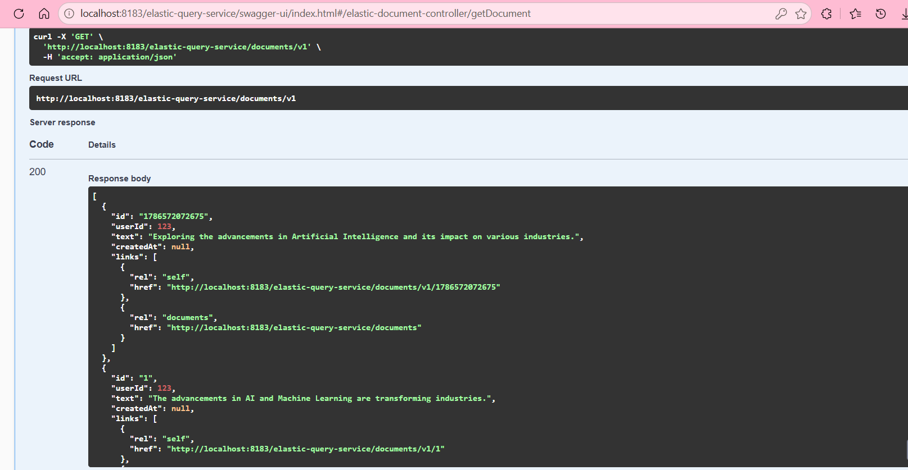
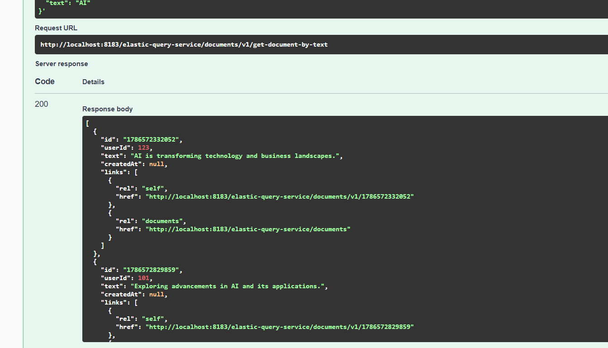
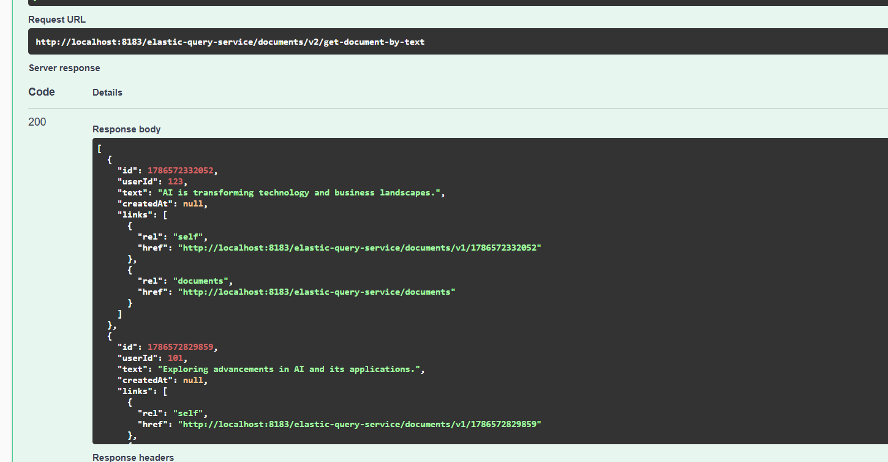

# Elastic Query Service

Bu servis, **Elasticsearch üzerinde bulunan Twitter document'larını sorgulamak ve REST API üzerinden client'lara sunmak** için kullanılır.

## Genel Akış

```text
Client
  ↓
Spring Security
  ↓
ElasticDocumentController
  ↓
TwitterElasticQueryService
  ↓
ElasticQueryClient
  ↓
Elasticsearch
```

Elasticsearch'ten gelen veri, API response modeline dönüştürülerek JSON olarak client'a gönderilir.

---

## Service Layer

`TwitterElasticQueryService`, `ElasticQueryService` interface'ini implement eder ve Elasticsearch sorgularını yönetir.

Temel işlemler:

```
getAllDocuments()
getDocumentById(String id)
getDocumentsByText(String text)
```

`ElasticQueryClient<TwitterIndexModel>` Elasticsearch ile iletişim kurar.

Elasticsearch'ten gelen `TwitterIndexModel`, `ElasticQueryServiceResponseModelAssembler` tarafından API response modeline dönüştürülür.

```text
Elasticsearch
      ↓
TwitterIndexModel
      ↓
Assembler / Transformer
      ↓
ElasticQueryServiceResponseModel
```

Böylece Elasticsearch'te kullanılan internal model doğrudan REST API üzerinden dışarı açılmaz.

`TwitterIndexModel`, Elasticsearch'te verinin nasıl tutulduğunu temsil ederken `ElasticQueryServiceResponseModel`, client'a verinin nasıl sunulacağını temsil eder. Şu anda iki model benzer alanlara sahip olsa da sorumlulukları farklıdır.

---

## Controller

`ElasticDocumentController`, HTTP isteklerini karşılar ve ilgili Service metodunu çağırır.

### Endpoints

| Method | Endpoint | Description |
| --- | --- | --- |
| GET | `/documents/v1` | Tüm document'ları getirir |
| GET | `/documents/v1/{id}` | ID ile V1 document getirir |
| GET | `/documents/v2/{id}` | ID ile V2 document getirir |
| POST | `/documents/v1/get-document-by-text` | Text ile V1 araması yapar |
| POST | `/documents/v2/get-document-by-text` | Text ile V2 araması yapar |

Controller'ın döndürdüğü Java nesneleri Spring MVC tarafından **Jackson** kullanılarak JSON'a çevrilir ve HTTP response body'ye yazılır.

---

## Common Module

`elastic-query-service-common`, farklı query servisleri tarafından ortak kullanılabilecek sınıfları içerir.

```text
ElasticQueryServiceRequestModel
ElasticQueryServiceResponseModel
ElasticToResponseModelTransformer
ElasticQueryServiceErrorHandler
```

Amaç, ortak request/response modellerini, dönüşüm işlemlerini ve hata yönetimini farklı modüllerde tekrar yazmak yerine tek bir yerde tutmaktır.

---

## API Versioning - V1 / V2

Projede API versioning uygulanmıştır.

### V1

V1 endpoint'leri common modülündeki `ElasticQueryServiceResponseModel` modelini kullanır.

V1'de `id` alanı `String` tipindedir:

```
private String id;
```

Örnek response:

```json
{
  "id": "123",
  "userId": 25,
  "text": "Java"
}
```

### V2

V2 için `elastic-query-service` içerisinde ayrı bir `ElasticQueryServiceResponseModelV2` oluşturulmuştur.

V2 modelinde `id` tipi `String`'den `Long`'a değiştirilmiştir:

```
private Long id;
```

Örnek response:

```json
{
  "id": 123,
  "userId": 25,
  "text": "Java"
}
```

V1'i doğrudan değiştirmek yerine V2 oluşturulmasının amacı, mevcut client'ları bozmadan API'nin yeni versiyonunu sunabilmektir.

```text
V1                         V2

id: String                 id: Long
"123"                      123
```

Bu yaklaşım **backward compatibility** sağlar.

---

## DocumentModelMapper

`DocumentModelMapper`, V1 response modelini V2 response modeline dönüştürür.

```text
ElasticQueryServiceResponseModel
             ↓
      DocumentModelMapper
             ↓
ElasticQueryServiceResponseModelV2
```

Özellikle aşağıdaki dönüşüm yapılır:

```
Long.valueOf(responseModel.getId())
```

Yani:

```text
"123" → 123L
```

V2 endpoint'lerinde Elasticsearch'e farklı bir sorgu gönderilmez. Aynı Service sonucu alınır ve `DocumentModelMapper` kullanılarak V2 response modeline dönüştürülür.

---

## HATEOAS

Response modelleri Spring HATEOAS'ın `RepresentationModel` sınıfını extend eder.

```
extends RepresentationModel<...>
```

Bunun amacı response nesnelerine ilgili resource'lara ait linkler ekleyebilmektir.

Örneğin:

```json
{
  "id": "123",
  "text": "Java",
  "_links": {
    "self": {
      "href": "/documents/v1/123"
    }
  }
}
```

`DocumentModelMapper` içerisindeki:

```
model.add(responseModel.getLinks());
```

satırı V1 modelindeki HATEOAS linklerini V2 modeline aktarır.

---

## Security

`WebSecurityConfig`, REST API endpoint'lerine erişimi kontrol eder.

Projede **HTTP Basic Authentication** kullanılmaktadır.

```text
Request
   ↓
Spring Security
   ↓
Username / Password
   ↓
Role Control
   ↓
Controller
```

`SecurityProperties.pathsToIgnore` içerisinde bulunan endpoint'ler:

```
.requestMatchers(
    securityProperties.getPathsToIgnore().toArray(new String[0])
).permitAll()
```

ile authentication gerektirmeden kullanılabilir.

Diğer bütün endpoint'ler:

```
.anyRequest().hasRole("USER")
```

ile yalnızca `USER` rolüne sahip kullanıcılara açılır.

Demo amaçlı kullanıcılar database yerine `InMemoryUserDetailsManager` içerisinde tutulur.

Şifreler `BCryptPasswordEncoder` kullanılarak encode edilir.

---

## Request / Response Akışı

```text
HTTP Request
      ↓
Spring Security
      ↓
ElasticDocumentController
      ↓
TwitterElasticQueryService
      ↓
ElasticQueryClient
      ↓
Elasticsearch
      ↓
TwitterIndexModel
      ↓
Assembler / Transformer
      ↓
ElasticQueryServiceResponseModel
      ↓
V1 / V2 Mapping
      ↓
Jackson
      ↓
JSON Response
```

---

## Özet

- **ElasticDocumentController** → HTTP request/response işlemlerini yönetir.
- **TwitterElasticQueryService** → Elasticsearch sorgularını yönetir.
- **ElasticQueryClient** → Elasticsearch ile iletişim kurar.
- **TwitterIndexModel** → Elasticsearch'teki document modelini temsil eder.
- **ElasticQueryServiceResponseModel** → Ortak V1 API response modelidir.
- **Common Module** → Ortak model, transformer ve error handling kodlarını içerir.
- **DocumentModelMapper** → V1 response modelini V2 response modeline dönüştürür.
- **ElasticQueryServiceResponseModelV2** → V2 API response modelidir.
- **V1 / V2** → API versioning ve backward compatibility sağlar.
- **RepresentationModel** → HATEOAS link desteği sağlar.
- **WebSecurityConfig** → Authentication ve authorization kurallarını yönetir.
- **WebSecurityConfig** → Authentication ve authorization kurallarını yönetir.

Ayrıca burada egıtım amaclı elastic-query-client vardır(webcient yoktur)
### User Configuration

HTTP Basic Authentication için kullanılan demo kullanıcı bilgileri `application.yml` içerisinde tanımlanır:

```yaml
user-config:
  username: test
  password: '{cipher}...'
  roles: USER
```

`password` değeri düz metin olarak tutulmaz, encrypted olarak saklanır.

> **Not:** Encryption/decryption için kullanılan key güvenlik nedeniyle repository içerisinde paylaşılmaz. Projeyi çalıştırmadan önce gerekli encryption key'in environment variable veya ilgili runtime configuration üzerinden sağlanması gerekir

## RUN 
Servis başarıyla çalıştırıldıktan sonra Swagger UI üzerinden endpoint'ler test edilebilir.

Aşağıdaki örnekte `GET /documents/v1` isteği sonucunda Elasticsearch'teki document'lar başarıyla dönmektedir. Response içerisindeki `links` alanı HATEOAS tarafından eklenen resource bağlantılarını göstermektedir.


HATEOAS, REST API'yi hypermedia destekli hale getirir ve Richardson Maturity Model'in Level 3 seviyesini temsil eder. Client'a yalnızca resource verisi değil, ilgili resource'lara ulaşabileceği linkler de sunulur.


### API Versioning Test

API versioning, mevcut client'ları bozmadan API üzerinde değişiklik yapabilmek için kullanılır.

Bu projede V1'de `id` alanı `String`, V2'de ise `Long` olarak döndürülmektedir. V1 korunarak yeni V2 endpoint'lerinin oluşturulması **backward compatibility** sağlar.

```text
V1                              V2

"id": "1786572332052"           "id": 1786572332052
       ↑                               ↑
     String                           Long
```

Her iki versiyon da aynı Elasticsearch verisini kullanır. V2 için Elasticsearch'e farklı bir sorgu gönderilmez; V1 response modeli `DocumentModelMapper` aracılığıyla V2 response modeline dönüştürülür.

#### V1 Response

`POST /documents/v1/get-document-by-text`

V1 response'unda `id` değeri `String` olarak döner:



#### V2 Response

`POST /documents/v2/get-document-by-text`

V2 response'unda aynı `id` değeri `Long` olarak döner:

