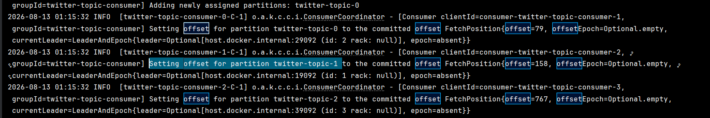
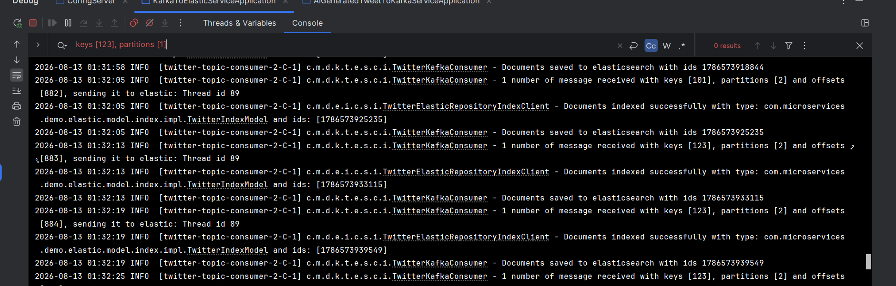
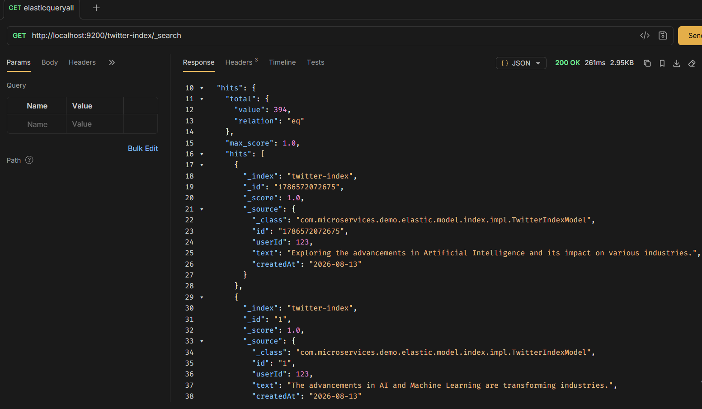

## Kafka Consumer → Elasticsearch Akışı

Bu servis, Kafka'dan gelen tweetleri alıp Elasticsearch'e kaydeder.

### Akış

`Producer` → `TwitterAvroModel` → `Kafka (twitter-topic)` → `TwitterKafkaConsumer` → `TwitterIndexModel` → `Elasticsearch`

### Nasıl Çalışır?

- `@KafkaListener`, `twitter-topic` topic'ini dinler. Mesaj gelince `receive()` otomatik çalışır.
- Listener otomatik başlamaz (`auto-startup: false`). Uygulama başladıktan ve Kafka kontrolleri yapıldıktan sonra `.start()` ile başlatılır.
- Mesajlar `batch-listener: true` olduğu için liste halinde alınır.
- Kafka'daki veri `KafkaAvroDeserializer` tarafından otomatik olarak `TwitterAvroModel` nesnelerine dönüştürülür.
- `AvroToElasticModelTransformer`, `TwitterAvroModel` → `TwitterIndexModel` dönüşümünü yapar.
- `ElasticIndexClient`, oluşan `TwitterIndexModel` nesnelerini Elasticsearch'e kaydeder.
- Aynı consumer group'taki consumer'lar mesajları paylaşarak tüketir. Farklı consumer group'lar ise aynı topic'i bağımsız olarak tüketebilir.

### Model Ayrımı

- `TwitterAvroModel` → Kafka'da veri taşımak için kullanılır.
- `TwitterIndexModel` → Elasticsearch'e veri kaydetmek için kullanılır.
----------
Aşağıdaki loglar, `twitter-topic-consumer` consumer group'unun Kafka'daki kayıtlı offset'lerden devam ettiğini göstermektedir.

- `twitter-topic-0` → offset `79`
- `twitter-topic-1` → offset `158`
- `twitter-topic-2` → offset `767`

`concurrency-level: 3` olduğu için aynı consumer group içerisinde 3 consumer çalışır ve partition'lar bu consumer'lar arasında paylaşılır.

Uygulama yeniden başlatıldığında consumer, kayıtlı (`committed`) offset'leri kullanarak kaldığı yerden tüketmeye devam eder.



-------------------

### Kafka Mesajlarının Tüketilmesi

Consumer, Kafka'dan mesajları `key`, `partition` ve `offset` bilgileriyle alarak Elasticsearch'e kaydeder.

- `key` → Producer tarafından gönderilir (`userId`). Aynı key'e sahip mesajlar aynı topic içinde aynı partition'a yönlendirilir.
- `partition` → Mesajın topic içerisinde hangi partition'da bulunduğunu gösterir.
- `offset` → Mesajın bulunduğu partition içerisindeki sırasıdır. Her partition'ın kendi offset sırası vardır; consumer'a özel değildir.
- `Thread id` → Mesajı işleyen consumer thread'ini gösterir. Aynı partition'ı tüketen mesajlar genellikle aynı consumer/thread tarafından işlenir.
- `Documents indexed successfully` → Mesajın Elasticsearch'e başarıyla kaydedildiğini gösterir.

Bu nedenle aynı `key` ile gönderilen mesajların aynı partition'a gitmesi, mesajların kendi aralarındaki sırasının korunmasını sağlar.

```
key = 123
↓
Kafka partition seçer
↓
Partition 2
↓
offset 763
offset 764
offset 765
↓
Consumer Thread
↓
Elasticsearch
```
### Elasticsearch Kontrolü

Kafka'dan tüketilen mesajların Elasticsearch'e kaydedildiğini doğrulamak için `twitter-index` sorgulanır:

```http
GET http://localhost:9200/twitter-index/_search
```

`200 OK` yanıtı ve `_source` altında dönen kayıtlar, verilerin Elasticsearch'e başarıyla kaydedildiğini gösterir.



> **Not:** `http://localhost:9200/twitter-index/_search` uygulama tarafından oluşturulan bir endpoint değildir. Elasticsearch kendi REST API'sini sağlar. Elasticsearch, Docker Compose üzerinden `9200` portunda çalıştırıldığı için `_search` endpoint'i kullanılarak `twitter-index` doğrudan sorgulanabilir.
